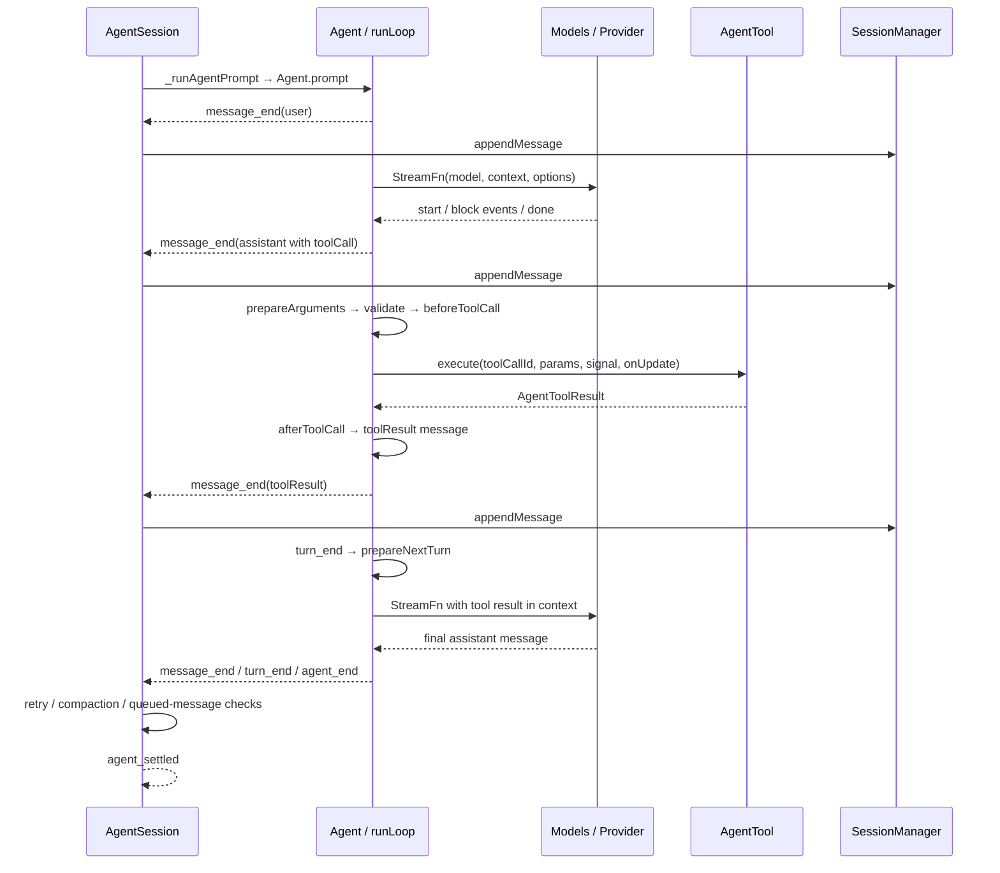

# 从课程回到 Pi 源码

先运行课程里的离线轨迹，再用本页追到官方实现。这里区分三类材料：课程代码用于逐步重建概念；教材解释对应 checkpoint；官方源码用于确认公开接口与完整行为。三者不能互相替代。推荐搭配 [学习计划](../STUDY_PLAN.md)、[Checkpoint 00 笔记](00-prologue.md) 和 [官方 SDK 离线实验](../labs/README.md) 阅读。

## 固定版本与来源

| 材料 | 仓库固定提交 | 适用范围 |
| --- | --- | --- |
| Earendil Works Pi | [`a69bef789bc95abf0acee16f7b4660b70b650bb9`][pi-commit] | `pi/`；`pi-ai`、`pi-agent-core`、`pi-coding-agent` 的包版本均为 `0.84.2` |
| 《动手学 Pi》课程分支 | [`fe8b8699b6bef90a3e1347214488c9ef191d56b9`][course-commit] | `pi-course/`；教学包 `@pi/course@0.0.1`，checkpoint 00–14 |
| 《动手学 Pi》中文教材 | [`20dd3a7d791c2470a87c5172aa0729c3963a6b18`][book-commit] | `pi-textbook/`；下面的章节链接均指向本地固定快照 |

课程分支从官方提交 `8479bd84` 出发，该起点的 `pi-ai` 包版本是 `0.80.6`。课程新增的 `packages/pi-course/` 有自己的 `Model`、`Message`、`ToolRegistry` 和 `Runtime`，并不是官方 SDK 的同名别名。例如课程 loop 有 `maxSteps` 与 `tool_start`，官方底层 loop 使用 `shouldStopAfterTurn` 与 `tool_execution_start`。把课程代码移植到 SDK 时，要重新核对类型与生命周期；不能只改 import。[课程说明][course-readme]、[课程起点包声明][course-base-package]和[官方循环类型][agent-types]给出了边界。

本页从作者此前的《项目解读.md》《ai 包源码精读.md》《agent 包源码精读.md》《coding-agent 包源码精读.md》选读本次涉及的核心主题，对照上述官方快照整理；不是原始资料的全文校勘。原文未公开，本仓库不复制全文。npm `v0.84.2` 的发布提交是 [`914cf147`](https://github.com/earendil-works/pi/tree/914cf1472e715297caa30db4b9535d534a9eb718)，固定源码 `a69bef789` 含其后的未发版改动，特别是 coding-agent 讲解只适用于后者。实验使用发布版：Agent、agent-loop、agent/types、Models、Faux、EventStream 与 validation 已比对一致。仅包版本不足以定位全部源码，应同时记录 commit。

官方 Pi 和课程代码沿用各自 MIT 许可。《动手学 Pi》由 Chunhao Zhang 创作，教材正文、图示与原创媒体采用 [CC BY 4.0][book-license]；本页链接教材并保留出处，讲解为重新组织的学习说明。

## 主题、课程与源码对应

表中的课程实现路径均相对于 `pi-course/packages/pi-course/src/`；教材链接可在初始化子模块后直接阅读。源码链接固定到本页核验的官方 commit，进入文件后按符号搜索，避免依赖行号。

| 学习主题 | 课程入口 | 中文教材 | 官方源码与关键符号 | 对照重点 |
| --- | --- | --- | --- | --- |
| 整体反馈闭环 | 00：`demo/prologue.ts` | [00 离线轨迹](../pi-textbook/content/chapters/00-prologue.md) | [`main.ts`][main]：`main`；[`agent-loop.ts`][agent-loop]：`runLoop` | 00 播放固定 fixture，不调用模型或文件工具；官方入口还要组装配置、模型与会话 |
| 消息与流 | 01–03：`survival/events.ts`、`event-stream.ts`、`types.ts` | [01 类型](../pi-textbook/content/chapters/01-typescript-survival.md)、[02 流](../pi-textbook/content/chapters/02-event-stream.md)、[03 消息](../pi-textbook/content/chapters/03-message-ir.md) | [`ai/types.ts`][ai-types]：`Message`、`AssistantMessageEvent`；[`EventStream`][event-stream] | partial 用于展示；终态与 `result()` 才确定最终消息 |
| 模型与 Provider | 04–05：`scripted-model.ts`、`provider-adapter.ts` | [04 ScriptedModel](../pi-textbook/content/chapters/04-scripted-model.md)、[05 Provider](../pi-textbook/content/chapters/05-provider-adapter.md) | [`models.ts`][models]：`createModels`、`Provider`；[`faux.ts`][faux]：`fauxProvider`；[`openai-completions.ts`][openai] | 课程提供可观察的请求快照；官方还处理认证、目录与协议差异 |
| 工具契约与文件工具 | 06、08：`tool.ts`、`coding-tools.ts` | [06 工具契约](../pi-textbook/content/chapters/06-tool-contract.md)、[08 编码工具](../pi-textbook/content/chapters/08-coding-tools.md) | [`agent/types.ts`][agent-types]：`AgentTool`；[`tools/index.ts`][tools]：`createCodingTools` | 区分 schema、执行函数与供界面使用的工具定义 |
| 循环与状态 | 07、09：`agent-loop.ts`、`agent.ts` | [07 循环](../pi-textbook/content/chapters/07-agent-loop.md)、[09 状态](../pi-textbook/content/chapters/09-stateful-agent.md) | [`agent-loop.ts`][agent-loop]：`runAgentLoop`、`executeToolCalls`；[`agent.ts`][agent]：`Agent` | 先看两轮工具往返，再看并发、取消、队列与空闲条件 |
| 会话树 | 10：`session.ts` | [10 会话](../pi-textbook/content/chapters/10-session-tree.md) | [`session-manager.ts`][session-manager]：`SessionManager`、`buildSessionContext` | 完整历史、当前分支、模型可见消息是三个不同对象 |
| 上下文压缩 | 11：`context.ts` | [11 压缩](../pi-textbook/content/chapters/11-context-compaction.md) | [`compaction.ts`][compaction]：`prepareCompaction`、`compact`；[`AgentSession`][agent-session]：`_checkCompaction` | 课程可重复验证切点；官方摘要通常需要一次额外模型调用 |
| 资源与扩展 | 12：`resources.ts` | [12 资源与扩展](../pi-textbook/content/chapters/12-resources-extensions.md) | [`resource-loader.ts`][resources]：`DefaultResourceLoader`；[`extensions/types.ts`][extension-types]：`ExtensionAPI` | 文件被发现、被载入与进入模型上下文并非同一动作 |
| 组合与完成 | 13：`composition.ts` | [13 Runtime](../pi-textbook/content/chapters/13-composition-root.md) | [`sdk.ts`][sdk]：`createAgentSession`；[`agent-session-runtime.ts`][runtime]：`AgentSessionRuntime` | 课程 Runtime 与官方 AgentSession/Runtime 的职责要分别辨认 |
| 独立验收 | 14：课程 `test/` | [14 Eval](../pi-textbook/content/chapters/14-eval-capstone.md) | [官方 Agent 测试][agent-tests]与[应用层测试][coding-tests] | 对外观察结果；区分业务失败、协议失败与环境缺失 |

## 三层职责与一次工具调用

`ai` 定义模型、消息、内容块、事件与 Provider 边界，并处理模型目录和认证。`agent` 中的低层 `Agent` 管理运行状态、队列和事件，loop 负责把模型要求的动作交给工具，再把结果提供给下一轮模型。`coding-agent` 将这些能力接成 CLI 与 SDK 应用，增加具体编码工具、资源、扩展、会话和自动压缩。[模型入口][models]、[Agent 状态机][agent]、[应用组装][sdk]

这是学习时的职责切分，不是整个包的完整清单：固定版 `pi-agent-core` 还导出可复用的 Harness、会话与压缩能力。初次阅读先聚焦 `Agent`、`agent-loop.ts`、`types.ts`，之后按需要阅读 [`agent/src/index.ts`][agent-index] 的其他导出。

下面表示已经进入模型运行的一次正常工具往返；扩展命令、输入拦截、鉴权失败和压缩可能提前改变路径。第二次模型回复假设为纯文本终态。



图中的调用顺序来自 [`runLoop`][agent-loop]、[`AgentSession._handleAgentEvent` 与 `_runAgentPrompt`][agent-session]。图里的 `appendMessage` 表示交给会话管理器；是否立即写文件，见下面的持久化说明。

## ai：流、最终结果与 Provider

`AssistantMessageEventStream` 有两种消费方式：用 `for await` 处理事件，或用 `result()` 等待最终 `AssistantMessage`。`start` 和内容块事件含 `partial`；`done` 含 `message`，`error` 含 `error`。失败结果也携带 provider、usage 与可能已有的内容，不应只记录一个错误字符串。[事件类型][ai-types]、[队列实现][event-stream]

生产者要提供终态或调用 `end(result)`。只调用没有参数的 `end()` 会关闭迭代，却不会替消费者生成最终结果。另一个边界是 `EventStream` 自身不是“每个订阅者一份事件”的广播总线：多个迭代器会共享队列，教学实验应让一个消费者收集事件，再从收集结果比较不同观察方式。[EventStream][event-stream]

当前公开主入口推荐显式创建 `Models`、注册 Provider，再取得 `Model` 并注入 `models.streamSimple.bind(models)`。`createModels()` 不会自动注册全部内置厂商。旧的全局 `getModel`/`streamSimple` 接口位于 `@earendil-works/pi-ai/compat`；不能把旧示例的 import 原样当作当前主入口。[主入口导出][ai-index]、[Models 实现][models]

模型流的应用层路径是：

```text
AgentMessage[]
  → transformContext（可选，仍是 AgentMessage[]）
  → convertToLlm（转为 ai 的 Message[]）
  → Context（systemPrompt / messages / tools）
  → StreamFn
  → Models.streamSimple → Provider.streamSimple → API adapter
```

前两步让应用保留自己的消息类型，同时在模型边界过滤或转换。自定义角色不能直接塞给厂商 API。Provider 的 `api` 与 `provider` 是不同维度：同一服务商可以提供多个协议，多个服务商也可以共用 OpenAI 兼容协议。[消息转换][agent-loop]、[Provider 分发][models]

推理强度也不应只记住一张静态表。ai 的 `ThinkingLevel` 包括 `minimal/low/medium/high/xhigh/max`，Agent 另外允许 `off`，调用时将其转为未设置 reasoning。`thinkingLevelMap` 的值是字符串或 null，不存 token 数字；Anthropic 的预算型路径通过 `thinkingBudgetForLevel` 与自定义 budgets 计算，adaptive 路径才映射 effort。实际支持档位由 `getSupportedThinkingLevels` 判断；`clampThinkingLevel` 对缺失档位先查更高可用档位，再向低档回退，不总是“向下降级”。[类型][ai-types]、[档位处理][models]、[预算辅助][simple-options]、[Anthropic 适配器][anthropic]

## agent：工具、队列与空闲

普通工具调用经过三站。准备阶段查找工具，调用可选的 `prepareArguments`，校验 schema，再运行 `beforeToolCall`。校验包含 `Value.Convert` 类型转换，因此数字可能转为字符串；缺失必填字段则形成明确的拒绝路径。[参数校验][validation] 执行阶段运行 `execute` 并发出可选更新。定稿阶段运行 `afterToolCall`，发出完成事件，并构造 `ToolResultMessage`。找不到工具、参数错误或被阻断时会产生错误回执；不能把 tool call 当作执行成功。[工具流水线][agent-loop]

默认并行模式先按调用顺序准备全部工具，再并发执行和定稿。`tool_execution_end` 可按完成顺序出现；模型使用的 toolResult 消息在全部结果就绪后按 assistant 原始调用顺序写入。任何一个工具标记 `executionMode: "sequential"`，或者配置全局 sequential，都会使整批走串行路径。因此界面看到的“先完成”与模型历史中的顺序可能不同。[分发与结果排序][agent-loop]

`stopReason: "length"` 的 assistant 即使已经包含看似合法的参数，整批工具也不会执行。loop 为每个调用生成错误回执，让模型有机会重发完整参数；这是截断防护，不是 schema 校验失败的普通路径。[截断分支][agent-loop]

`terminate` 是工具结果的提示：只有本批所有最终结果都为 true 才关闭工具驱动的续跑理由。steering 和 follow-up 仍可触发下一轮。`shouldStopAfterTurn` 返回 true 才会在该位置直接结束，跳过后续队列读取。取消则通过 AbortSignal 传播，需要流函数与工具配合响应。[终止规则与队列][agent-loop]、[契约][agent-types]

首轮从 `Agent.createContextSnapshot`/`createLoopConfig` 获取 state；之后 `prepareNextTurn` 在 `turn_end` 后执行，才影响后续请求。应用层安装的 `prepareNextTurnWithContext` 刷新 systemPrompt、tools、model 和 thinkingLevel，不能解释为“每次模型调用开始前重新加载全部资源”。[Agent 快照][agent]、[应用刷新钩子][agent-session]

底层 `agent_end` 表示该运行不会再发 loop 事件。Agent 仍会等待该事件的异步订阅者，最后由 `finishRun` 清理状态，所以需要可靠等待时用 `await agent.prompt(...)` 或 `agent.waitForIdle()`。只收到事件，不等同于全部监听器已完成。[Agent 生命周期][agent]

## coding-agent：会话、压缩与扩展

`AgentSession.prompt` 先处理扩展命令、输入钩子和模板，再进行运行状态与认证检查，最后才进入 Agent。`_runAgentPrompt` 在底层运行结束后检查重试、压缩与后处理中新加入的排队消息，需要时再次调用 `Agent.continue()`。完成这些工作后才发应用层 `agent_settled`。[prompt 管线][agent-session]

两种“结束”要按层观察：

| 信号 | 观察层 | 含义 |
| --- | --- | --- |
| `agent_end` | 底层 Agent | 一次 loop 运行停止；应用层还可能重试或压缩 |
| `agent_settled` | AgentSession | 本次由会话驱动的运行及其后处理结束 |
| `waitForIdle()` | 对应对象 | 等待各自层的空闲条件，应与实际调用的对象配对 |

“一个 prompt 恰好一个 agent_settled”只适用于进入会话运行管线的情况。注册命令被直接处理、input 被扩展截获、鉴权失败，以及运行中仅把消息排队的 `prompt()`，都不启动一条独立的完整运行。实际应用应结合 `session.prompt` 的返回语义与 session 的空闲 API。[会话入口与等待][agent-session]

会话历史使用有 `id/parentId` 的条目树，`buildSessionContext` 沿当前活动分支重建模型可见历史。JSONL 包含完整条目；压缩不会简单删除文件里的旧消息，而是追加 compaction 条目，然后重建“摘要与保留内容”的模型上下文。[会话管理][session-manager]、[压缩策略][compaction]

`_handleAgentEvent` 在 `message_end` 时交给 SessionManager 保存。不过 `inMemory()` 不写文件；新持久化会话一般要等第一条 assistant 才首次写出，此前的 user 和配置条目暂存在内存。实现使用同步文件写入，不能据此宣称断电时保证零丢失。[SessionManager._persist][session-manager]

自动压缩通过 `_checkCompaction` 区分阈值和溢出恢复，并允许扩展 `session_before_compact` 取消或提供结果。默认摘要需要调用模型，因此真实 Provider 场景可能额外计费。压缩结果经 `appendCompaction` 入树，`agent.state.messages` 被重建；后续 prompt/continue 获取新快照。刷新下一轮钩子主要处理 prompt、工具与模型设置，并不重新读取 state.messages。[自动压缩与扩展][agent-session]

工具扩展的返回值与参数修改要分开理解。`ToolCallEventResult` 的返回字段是 `block/reason/terminate`；扩展也可以原地修改 `event.input`。该 input 已经经过 schema 校验，修改后不会自动再次校验，扩展自己要保证参数有效。`tool_result` 允许替换 content/details/isError/usage；不要把 Agent 层所有结果字段都假定为扩展 API 的返回字段。[扩展契约][extension-types]、[钩子接线][agent-session]

## 用实验验证，再尝试扩展

先在 [SDK 离线实验](../labs/README.md) 运行 demo 和测试，观察两次模型请求之间究竟增加了哪些消息。随后按学习计划完成 checkpoint 06–09，比较并行完成顺序与结果写入顺序，观察截断工具如何收到错误回执，再回到 10–13 理解状态、会话和资源组合。

扩展时一次只改一个边界：换一组预设模型回复验证循环；增加纯函数工具验证 schema 和结果；订阅事件验证状态；最后再尝试官方 coding-agent 的自定义工具或扩展。使用真实模型前按实验文档配置环境变量并了解费用。

不要把“支持 Faux”理解为“上游全部测试都离线”。官方 ai 的 [context-overflow 集成测试][overflow-tests]包含真实 Provider 调用，部分按凭证或本地服务存在与否跳过。学习工程的离线测试通过证明它实际覆盖的协议；真实厂商接入、生产目录发现和自动摘要仍需单独验证。Checkpoint 14 提供独立评测方法，并不自动证明本仓库实现了完整官方框架。

[pi-commit]: https://github.com/earendil-works/pi/tree/a69bef789bc95abf0acee16f7b4660b70b650bb9
[course-commit]: https://github.com/hahhforest/pi/tree/fe8b8699b6bef90a3e1347214488c9ef191d56b9
[book-commit]: https://github.com/hahhforest/pi-textbook/tree/20dd3a7d791c2470a87c5172aa0729c3963a6b18
[course-readme]: https://github.com/hahhforest/pi/blob/fe8b8699b6bef90a3e1347214488c9ef191d56b9/packages/pi-course/README.md
[course-base-package]: https://github.com/earendil-works/pi/blob/8479bd84743e8889f728acb21a62794102db0529/packages/ai/package.json
[book-license]: https://github.com/hahhforest/pi-textbook/blob/20dd3a7d791c2470a87c5172aa0729c3963a6b18/LICENSE-CONTENT
[main]: https://github.com/earendil-works/pi/blob/a69bef789bc95abf0acee16f7b4660b70b650bb9/packages/coding-agent/src/main.ts
[ai-types]: https://github.com/earendil-works/pi/blob/a69bef789bc95abf0acee16f7b4660b70b650bb9/packages/ai/src/types.ts
[ai-index]: https://github.com/earendil-works/pi/blob/a69bef789bc95abf0acee16f7b4660b70b650bb9/packages/ai/src/index.ts
[event-stream]: https://github.com/earendil-works/pi/blob/a69bef789bc95abf0acee16f7b4660b70b650bb9/packages/ai/src/utils/event-stream.ts
[validation]: https://github.com/earendil-works/pi/blob/a69bef789bc95abf0acee16f7b4660b70b650bb9/packages/ai/src/utils/validation.ts
[models]: https://github.com/earendil-works/pi/blob/a69bef789bc95abf0acee16f7b4660b70b650bb9/packages/ai/src/models.ts
[faux]: https://github.com/earendil-works/pi/blob/a69bef789bc95abf0acee16f7b4660b70b650bb9/packages/ai/src/providers/faux.ts
[openai]: https://github.com/earendil-works/pi/blob/a69bef789bc95abf0acee16f7b4660b70b650bb9/packages/ai/src/api/openai-completions.ts
[simple-options]: https://github.com/earendil-works/pi/blob/a69bef789bc95abf0acee16f7b4660b70b650bb9/packages/ai/src/api/simple-options.ts
[anthropic]: https://github.com/earendil-works/pi/blob/a69bef789bc95abf0acee16f7b4660b70b650bb9/packages/ai/src/api/anthropic-messages.ts
[agent-types]: https://github.com/earendil-works/pi/blob/a69bef789bc95abf0acee16f7b4660b70b650bb9/packages/agent/src/types.ts
[agent-loop]: https://github.com/earendil-works/pi/blob/a69bef789bc95abf0acee16f7b4660b70b650bb9/packages/agent/src/agent-loop.ts
[agent]: https://github.com/earendil-works/pi/blob/a69bef789bc95abf0acee16f7b4660b70b650bb9/packages/agent/src/agent.ts
[agent-index]: https://github.com/earendil-works/pi/blob/a69bef789bc95abf0acee16f7b4660b70b650bb9/packages/agent/src/index.ts
[tools]: https://github.com/earendil-works/pi/blob/a69bef789bc95abf0acee16f7b4660b70b650bb9/packages/coding-agent/src/core/tools/index.ts
[sdk]: https://github.com/earendil-works/pi/blob/a69bef789bc95abf0acee16f7b4660b70b650bb9/packages/coding-agent/src/core/sdk.ts
[agent-session]: https://github.com/earendil-works/pi/blob/a69bef789bc95abf0acee16f7b4660b70b650bb9/packages/coding-agent/src/core/agent-session.ts
[session-manager]: https://github.com/earendil-works/pi/blob/a69bef789bc95abf0acee16f7b4660b70b650bb9/packages/coding-agent/src/core/session-manager.ts
[compaction]: https://github.com/earendil-works/pi/blob/a69bef789bc95abf0acee16f7b4660b70b650bb9/packages/coding-agent/src/core/compaction/compaction.ts
[resources]: https://github.com/earendil-works/pi/blob/a69bef789bc95abf0acee16f7b4660b70b650bb9/packages/coding-agent/src/core/resource-loader.ts
[extension-types]: https://github.com/earendil-works/pi/blob/a69bef789bc95abf0acee16f7b4660b70b650bb9/packages/coding-agent/src/core/extensions/types.ts
[runtime]: https://github.com/earendil-works/pi/blob/a69bef789bc95abf0acee16f7b4660b70b650bb9/packages/coding-agent/src/core/agent-session-runtime.ts
[agent-tests]: https://github.com/earendil-works/pi/tree/a69bef789bc95abf0acee16f7b4660b70b650bb9/packages/agent/test
[coding-tests]: https://github.com/earendil-works/pi/tree/a69bef789bc95abf0acee16f7b4660b70b650bb9/packages/coding-agent/test
[overflow-tests]: https://github.com/earendil-works/pi/blob/a69bef789bc95abf0acee16f7b4660b70b650bb9/packages/ai/test/context-overflow.test.ts
